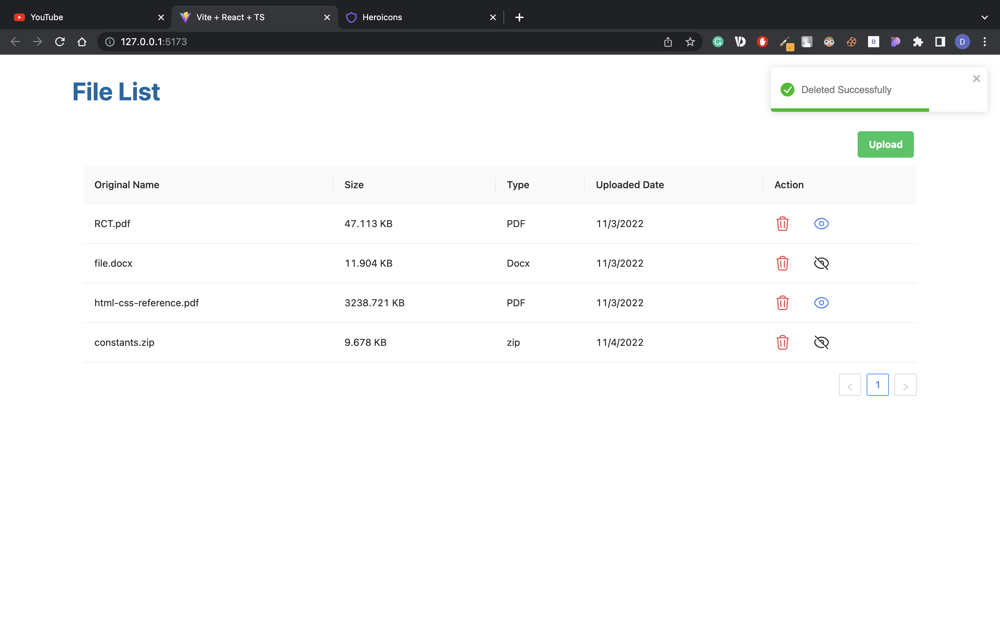

# File Uploader

Simple file uploading app.

## Install dependencies for backend

```
npm i
npm run dev
```

## Install dependencies for frontend

```
cd client && npm i
```

## Run App

```
npm run dev
```

## Images


